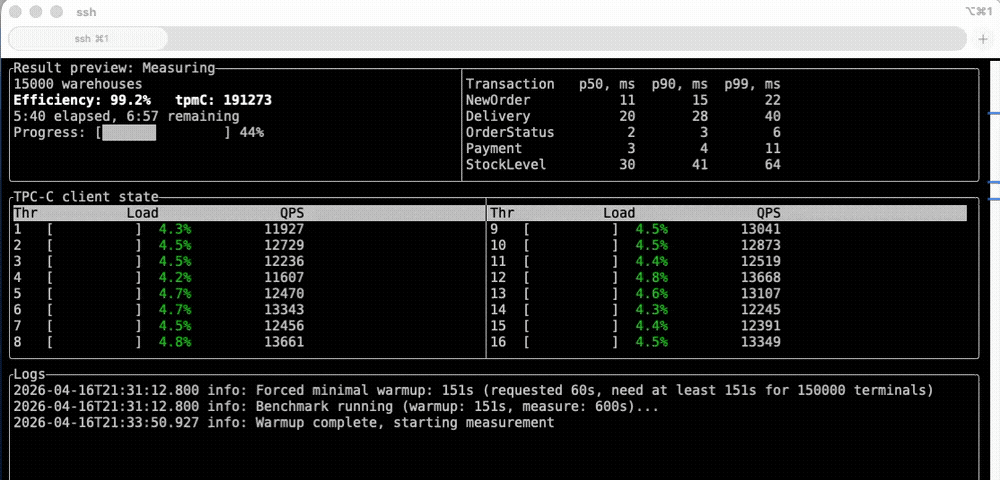

# TPC-C Benchmark for PostgreSQL

A C++23 implementation of the [TPC-C](http://www.tpc.org/tpcc/) benchmark for PostgreSQL, featuring an optional real-time terminal UI.

This project is ported (using Opus 4.6) from the [YDB CLI implementation](https://ydb.tech/docs/en/reference/ydb-cli/workload-tpcc). It uses C++20 coroutines, custom futures/promises and `libpqxx` for PostgreSQL access.



## Requirements

Hardware requirements depend on the particular hardware, but rough estimates are:
* CPU: at least 1 CPU core per 1000 warehouses (2 recommended).
* Memory: ~70 MiB per 1000 warehouses (100 MiB recommended).

Current version's import might be suboptimal unlike the original YDB implementation: 15K wh import takes 98 minutes vs. 36 minutes for YDB (and vs. 119 minutes benchbase, but on older PostgreSQL version).

## Performance notes
The current data import implementation is not yet fully optimized compared to the original YDB version. For example, 15K warehouses import time:
* This implementation: 98 minutes
* YDB: 36 minutes
* BenchBase (older PostgreSQL): 119 minutes

## Porting notes

By *porting* we mean:
1. Replacing YDB-specific types with standard C++ equivalents ((e.g., TString → std::string, TFuture from YDB → custom TFuture, etc.).
2. Translating queries from YQL to SQL
3. Replacing the YDB SDK with `libpqxx`

At the same time, the core benchmark logic remains unchanged.

On one hand, the LLM did an impressive job porting the codebase. On the other, the initial result omitted a number of important features, including:
* adaptive warmup and thundering herd avoidance
* proper auto-detection of the required thread count
* wiring for the import TUI
* various smaller details

Recovering these required careful review and multiple prompt iterations to bring the implementation back to feature parity.

## Dependencies

Requires Clang 16+ (tested with Clang 20) and the PostgreSQL client library:
```
sudo apt install libpq-dev
```

All other dependencies (fmt, spdlog, gflags, libpqxx, ftxui, googletest) are bundled
as git submodules and built automatically.

### tcmalloc (enabled automatically when available)

CMake looks for tcmalloc at configure time and links it into `tpcc`
automatically when found:

```
sudo apt install libgoogle-perftools-dev libtcmalloc-minimal4
cmake -B build -DCMAKE_CXX_COMPILER=clang++-20 -DCMAKE_BUILD_TYPE=Release
cmake --build build -j$(nproc)
```

The CMake status line will say `tpcc: linking tcmalloc (/usr/lib/...)` when
it is picked up. No `LD_PRELOAD` is needed: tcmalloc is linked directly into
the binary and overrides `malloc`/`free`/`operator new` via normal ELF symbol
resolution. Verify with `ldd ./build/tpcc | grep tcmalloc`.

Override the default with `-DTPCC_USE_TCMALLOC=ON` (require tcmalloc, fail
configure if absent) or `-DTPCC_USE_TCMALLOC=OFF` (use the system allocator).

## Building

```
git submodule update --init
cmake -B build -DCMAKE_CXX_COMPILER=clang++-20 -DCMAKE_BUILD_TYPE=Release
cmake --build build -j$(nproc)
```

## Running

### Quick start

```
# Create a database
createdb tpcc

# Create schema and indexes
./build/tpcc --command=init --warehouses=10

# Load data (10 warehouses, parallel import)
./build/tpcc --command=import --warehouses=10 --load-threads=8

# Verify loaded data
./build/tpcc --command=check --warehouses=10 --after-import

# Run the benchmark (5 minutes)
./build/tpcc --command=run --warehouses=10 --duration=5

# Run consistency checks after benchmark
./build/tpcc --command=check --warehouses=10

# Clean up
./build/tpcc --command=clean
```

### Connection

By default connects to `host=localhost dbname=tpcc user=postgres`.
Override with `--connection`:
```
./build/tpcc --command=run --connection="host=myhost dbname=tpcc user=bench password=secret"
```

### Options

Run `./build/tpcc --help` for the full list. Key options:

| Flag | Default | Description |
|------|---------|-------------|
| `--path` | `""` | PostgreSQL schema for benchmark tables (empty uses server search_path) |
| `--warehouses` | 1 | Number of warehouses (scales data and terminals) |
| `--duration` | 10 | Benchmark duration in minutes |
| `--warmup` | 0 | Warmup period in minutes before measurement starts (0 = adaptive) |
| `--skip-warmup` | false | Skip warmup entirely and start measurement immediately |
| `--threads` | auto | Coroutine threads |
| `--max-inflight` | 100 | Max concurrent transactions |
| `--no-delays` | false | Disable TPC-C keying/think time delays |
| `--no-tui` | false | Disable terminal UI (console output instead) |
| `--after-import` | false | Check: verify freshly loaded data (stricter invariants) |

## Testing

### Unit tests

Built automatically when Google Test is found:
```
cmake --build build --target tpcc_tests -j$(nproc)
./build/tpcc_tests
```

### Integration tests against PostgreSQL

A Docker Compose file is provided to spin up a PostgreSQL 18 instance:
```
docker compose up -d
```

Run the end-to-end smoke test (init, import, check, run, check, clean):
```
PGHOST=localhost PGUSER=postgres PGPASSWORD=postgres \
    TPCC_BIN=./build/tpcc tests/smoke_test.sh
```

The smoke test defaults to 10 warehouses and 120 seconds with standard TPC-C
keying/think time delays. Override via environment variables:
```
TPCC_WAREHOUSES=5 TPCC_DURATION=60 tests/smoke_test.sh
```

Per-transaction correctness tests (requires Google Test and a running PostgreSQL):
```
cmake --build build --target tpcc_pg_tests -j$(nproc)
TPCC_TEST_CONNECTION="host=localhost dbname=tpcc_test user=postgres password=postgres" \
    ./build/tpcc_pg_tests
```

### Simulation mode

Test the coroutine/IO infrastructure without a real database:
```
# Pure sleep simulation (no DB connection needed)
./build/tpcc --command=run --simulate-ms=50 --duration=1 --no-tui

# SELECT 1 simulation (needs a running PostgreSQL)
./build/tpcc --command=run --simulate-select1=5 --duration=1
```
